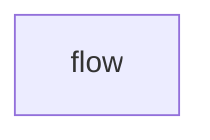

# 🌍 Monitorering af klimadata

| [**Beskrivelse**](#beskrivelse) | [**Afhængigheder**](#afh%C3%A6ngigheder) | [**Ressourcer**](#Ressourcer)

### Beskrivelse

Klima monitoren er 

- Lavfrekvent data hentes....
- Højfrekvent... 

### Afhængigheder
Løsningen er afhængig af en række software komponenter og en række netværksadgange til eksterne ressourcer for at fungere.

Krav til installerede software pakker 

:gear: | [Apache SuperSet 2.0]()  |  [Node-RED 3.0.2](https://nodered.org/docs/getting-started/windows)  | 

Krav til netværksadgange til datakilder

:cloud: | https://api.statbank.dk |  

Krav til adgangsgivende information:

:key: | Ingen |
