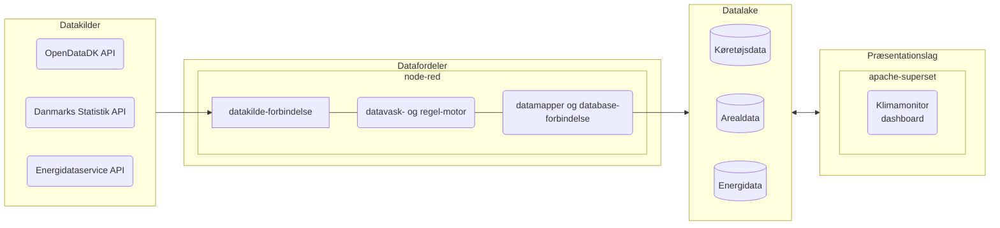

# 🌍 Monitorering af klimadata (klimadataprojektet)

| [**Beskrivelse**](#beskrivelse) | [**Afhængigheder**](#afh%C3%A6ngigheder) | [**Ressourcer**](#Ressourcer) |


### Beskrivelse

[Klimamonitoren](https://superset.data.randers.dk/superset/dashboard/klimamonitor/) er opbygget af en række løskoblede åbne komponenter

Datafordeleren sørger for at forbinde til datakildernes snitflader og foretager automatiske filtrer og konverteringerpå data der hentes fra snitfladerne inden de skrives i Datalake

Se klimamonitoren i drift: https://superset.data.randers.dk/superset/dashboard/klimamonitor/

### Afhængigheder
Løsningen er afhængig af en række software komponenter og en række netværksadgange til eksterne ressourcer for at fungere.

Krav til installerede software pakker 

:gear: | [Apache SuperSet 2.0]()  |  [Node-RED 3.0.2](https://nodered.org/docs/getting-started/windows)  | 

Krav til netværksadgange til datakilder

:cloud: | https://api.statbank.dk | https://admin.opendata.dk/ |

Krav til anvendelse af miljøvariable:

:heavy_dollar_sign: | DB_USER | DB_PASS | DB_HOST | DB_DATABASE |

### Ressourcer

:books: [Dokumentation og projektbeskrivelse](https://sbsip-web-drift01.randers.dk/sbsys/#/sager/495259)

:spiral_calendar: [Projektoverblik og opgavestyring](https://github.com/orgs/Randers-Kommune-Digitalisering/projects/2/)

### Deploy yil prototypes
Når en version er klar til at blive lagt på prototypes. Oprettes der et git tag i formatet v*.*.* fx v1.1.0
```
git tag v1.1.0
git push --tags
```
Her efter bygges et docker image med dette tag, samt bliver tagget opdatere i yaml for deplymentet i kithosting-randers-kommune-apps repo. 
Hereftet vil Argo-CD efter nogle minutter selv ligge den nye version på prototypes.
