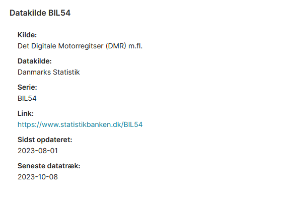
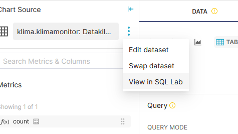
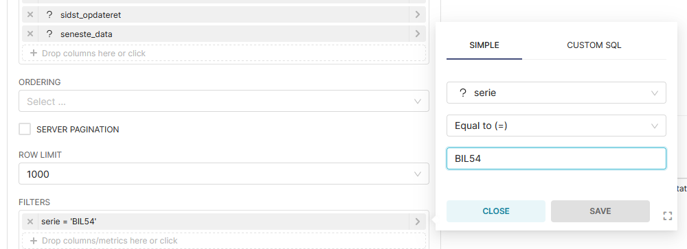
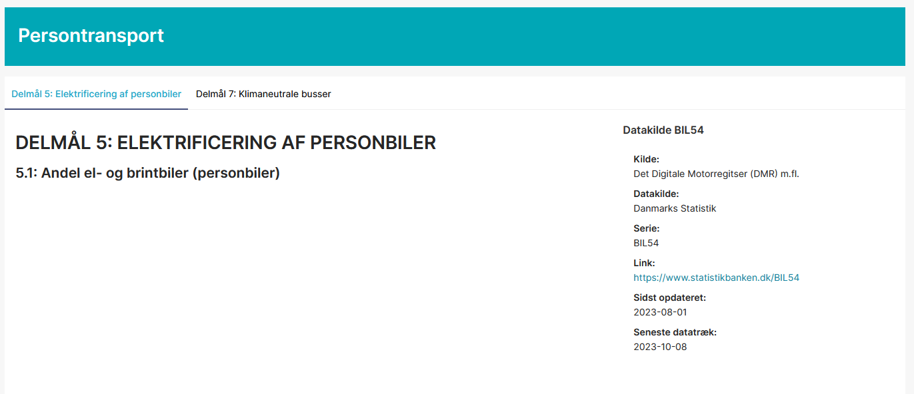

# Dokumentation af datakilder på Klimamonitoren
For at dokumentere datakilder ens på Klimamonitoren, anvendes et metadatasæt og et særlig chart:

* [`klimamonitor: Datakilder og seneste opdatering`](https://superset.prototypes.randers.dk/explore/?datasource_type=table&datasource_id=47)
* [`Handlebars-template: Datakilde`](https://superset.prototypes.randers.dk/explore/?slice_id=75)

Resultatet bliver (før evt. CSS)




## Hvordan tilføjes dokumentation på en datakilde?
### Trin 1: Tilføj data 
Åben datasættet [`klimamonitor: Datakilder og seneste opdatering`](https://superset.prototypes.randers.dk/explore/?datasource_type=table&datasource_id=47) i SQL Lab: 



Tilføj følgende stump SQL-kode nederst i SQL-forespørgslen:
```
UNION (select 
  "[KILDE]" as kilde,
  "[DATAKILD]" as datakilde, 
  "[SERIE]" as serie, 
  "[LINK]" as link,
  max([DATO]) as sidst_opdateret, 
  DATE_FORMAT(max(date(last_updated)), '%Y-%m-%d') as seneste_data
from [DATASÆT I SUPERSET])
```
Erstat:
* `[KILDE]` med angivelse af kilden
* `[DATAKILDE]` med angivelse af datakilden (dvs. hvor data trækkes fra. Fx. Danmarks Statistik eller Open Data DK)
* `[SERIE]` med angivelse af serien (fra URL'en fra Open Data DK eller serienavnet fra Danmarks Statistik). Skal være unikt for hvert datasæt 
* `[Link]` med et eventuelt link. http:// eller https:// skal tilføjes
* `[DATO]` med relevant datavariable for det pågældende datasæt
* `[DATASÆT I SUPERSET]` med navnet på det pågældende datasæt i Superset

Verificer at forespørgslen stadig kører og overskriv datasættet [`klimamonitor: Datakilder og seneste opdatering`](https://superset.prototypes.randers.dk/explore/?datasource_type=table&datasource_id=47). 

### Trin 2: Lav nyt chart 
Åben chartet [`Handlebars-template: Datakilde`](https://superset.prototypes.randers.dk/explore/?slice_id=75) og erstat filteret med værdien af `[SERIE]`. 



Gem chartet som et nyt chart med navnet "`Datakilde [SERIE]`". F.eks "`Datakilde BIL54`" 

### Trin 3: Tilføj chart til Klimamonitoren
Tilføj chartet til Klimamonitoren øverst ved siden af titlen for relevante delmål (flere delmål kan have samme kilde), således dokumentationen for alle delmål får samme udtryk. Evt. uddybende tekst kan skrives under titlen. 


